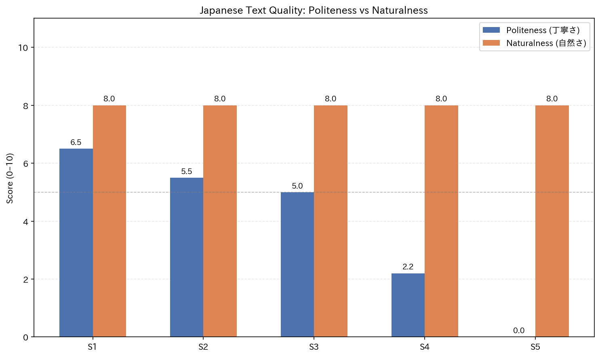

# Japanese AI Text Quality Evaluator

Evaluates Japanese LLM outputs on politeness (丁寧さ) and naturalness (自然さ) using keyword heuristics, with CSV export and visualization.

## Why This Exists

Evaluating Japanese AI text is hard to do at a glance - politeness levels (keigo, teineigo, casual) and natural fluency require native-level judgment. This tool automates a first-pass score using simple linguistic rules, making quality gaps visible before manual review.

## What It Does

- Scores Japanese text samples on politeness and naturalness (0-10 scale)
- Exports results to CSV for use in SQL-based analysis
- Generates a grouped bar chart comparing scores across samples

## Sample Output

## Setup

pip install pandas matplotlib numpy
pip install japanize-matplotlib  # optional, for Japanese text in charts
python evaluator.py

## Files

| File | Purpose |
|---|---|
| `evaluator.py` | Scoring logic, CSV export, chart generation |
| `queries.sql` | SQL queries for filtering and summarizing results |
| `japanese_text_evaluation.csv` | Output data |
| `japanese_text_evaluation_chart.png` | Output chart |

## Tech

Python (Pandas, Matplotlib, NumPy), SQL
